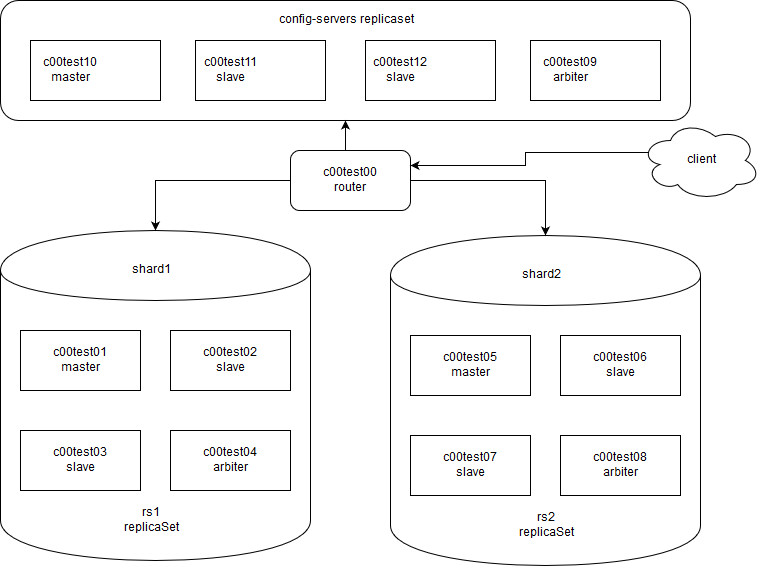

Тестировалось и запускалось все в среде:
gitlab -> gitlab-runner -> vagrant -> vsphere

Для работы с текущим ci, необходимо указать в конфигурации ci в gitlab, следующие переменные:
	VCENTER_HOST
	VCENTER_USER
	VCENTER_PASS

Так же, нужно ввести свои spec_name, template_name и прочее в Vagrantfile

В ci 5 стадий:
        1) деплой виртуалок
            - vagrant up
        2) dry-run плейбука
            - ansible-playbook -i ./hosts ./mongo_cluster.yml -vvv  --syntax-check
            - ansible-playbook -i ./hosts ./mongo_cluster_test.yml -vvv --syntax-check
        3) деплой плейбука
            - ansible-playbook -i ./hosts ./mongo_cluster.yml
        4) накат тестовой бд (manual)
            - ansible-playbook -i ./hosts ./mongo_cluster_test.yml
        5) удаление виртуалок (manual)
            vagrant destroy -f

Почему не написано как универсальное решение, с развертыванием одной кнопкой в разных окружениях:
У меня есть рабочее тестовое окружение, на котором стандартизирован деплой. Переделывать пайплайн для универсальности - пока времени нет.
Для того чтобы работало "как у меня", нужна vsphere, сервер gitlab с раннером, на котором есть vagrant, который сможет сходить к сфере. Плюс отредактировать инвентарный файл hosts.
Переменные можно посмотреть и изменить в group_vars/

Чтобы довести до продакшена:
        1) Пересмотреть архитектуру. Скорее всего одного роутера маловато будет.
        2) Добавить vault файл либо хранить логины/пароли/keyfile вне ролей.
        3) Можно генератор inventory вроде [kubespray inventory builder](https://github.com/kubernetes-incubator/kubespray/blob/master/contrib/inventory_builder/inventory.py)
        4) Заменить роль common. Написать роль аналогичную [этой](https://github.com/kubernetes-incubator/kubespray/tree/master/roles/kubernetes/preinstall) для предустановочной проверки (установлена ли mongodb, какие параметры и тп.), чтобы можно было многоразого запускать плейбук на одних и тех же машинах и ничего не отъезжало после повторго запуска.
        5) Произвести тонкую настройку конфигов mongo (ничего пока сказать по этой теме не могу, это мой первый опыт общения с mongo).

Немного описания на английскоим и примеры - под катом.

---cut---

##Deploying a sharded MongoDB(3.4) cluster with Ansible(2.1+)
------------------------------------------------------------------------------

- Requires Ansible 2.1+ 
- Expects CentOS/RHEL 7 hosts
 

### Deployment Example
------------------------------------------------------------------------------

The inventory file looks as follows:

		#The site wide list of mongodb servers
		[mongo_servers:children]
		rs1
		rs2

		#replication set 1
		[rs1]
		c00test01 ansible_host=<IP>
		c00test02 ansible_host=<IP>
		c00test03 ansible_host=<IP>
		c00test04 ansible_host=<IP>

		#replication set 2
		[rs2]
		c00test05 ansible_host=<IP>
		c00test06 ansible_host=<IP>
		c00test07 ansible_host=<IP>
		c00test08 ansible_host=<IP>

		#config servers
		[mongoc_servers]
		c00test09 ansible_host=<IP>
		c00test10 ansible_host=<IP>
		c00test11 ansible_host=<IP>
		c00test12 ansible_host=<IP>

		#router servers
		[mongos_servers]
		c00test00 ansible_host=<IP>

Build the cluster by mongodb playbook using the following command:

		ansible-playbook -i ./hosts ./mongo_cluster.yml

Load "test" db using the following command:

		ansible-playbook -i ./hosts ./mongo_cluster_test.yml

### Verifying the Deployment  
------------------------------------------------------------------------------

Once configuration and deployment has completed we can check replication set availability by connecting to mongo-router.
Exec `/usr/bin/mongo localhost:27020/admin -u admin -p 123456` 
27020 - default mongo-router port
and issue the command to query the status of replication set, we should get a similar output.
 
	mongos> sh.status()
	--- Sharding Status --- 
	  sharding version: {
		"_id" : 1,
		"minCompatibleVersion" : 5,
		"currentVersion" : 6,
		"clusterId" : ObjectId("5a354542d56dae2b1925f950")
	  }
	  shards:
			{  "_id" : "rs1",  "host" : "rs1/c00test01:27022,c00test02:27022,c00test03:27022",  "state" : 1 }
			{  "_id" : "rs2",  "host" : "rs2/c00test05:27022,c00test06:27022,c00test07:27022",  "state" : 1 }
	  active mongoses:
			"3.4.10" : 1
	  autosplit:
			Currently enabled: yes
	  balancer:
			Currently enabled:  yes
			Currently running:  no
	NaN
			Failed balancer rounds in last 5 attempts:  0
			Migration Results for the last 24 hours: 
					No recent migrations
	  databases:
			{  "_id" : "test",  "primary" : "rs1",  "partitioned" : true }

We can check the status of the test db shards as follows: connect to the mongos service `/usr/bin/mongo localhost:27020/admin -u admin -p 123456` on mongo-router
and issue the following command to get the status of the Shards:

	mongos> use test
	switched to db test
	mongos> db.user.find({_id: 1 }).explain()
	{
		"queryPlanner" : {
			"mongosPlannerVersion" : 1,
			"winningPlan" : {
				"stage" : "SINGLE_SHARD",
				"shards" : [
					{
						"shardName" : "rs1",
						"connectionString" : "rs1/c00test01:27022,c00test02:27022,c00test03:27022",
						"serverInfo" : {
							"host" : "c00test01",
							"port" : 27022,
							"version" : "3.4.10",
							"gitVersion" : "078f28920cb24de0dd479b5ea6c66c644f6326e9"
						},
						"plannerVersion" : 1,
						"namespace" : "test.user",
						"indexFilterSet" : false,
						"parsedQuery" : {
							"_id" : {
								"$eq" : 1
							}
						},
						"winningPlan" : {
							"stage" : "IDHACK"
						},
						"rejectedPlans" : [ ]
					}
				]
			}
		},
		"ok" : 1
	}

To show test collections content use the following command:

	mongos> db.getCollection("messages").find().forEach(printjson);

	mongos> db.getCollection("user").find().forEach(printjson);
